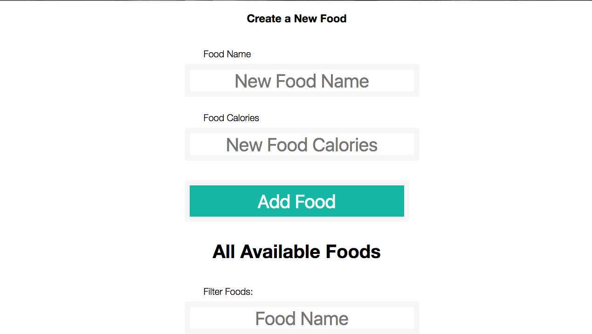

# Quantified Self

What's in this README?

- [What's it do?](#whats-it-do)
- [local setup instructions](#to-installrun-locally)
- [API endpoint documentation](#api-documentation)


[Colleen Ward](https://github.com/caward12) and [Josh Thompson](https://github.com/josh-works) built a sweet calorie tracking application.

Front-end available live at

- https://caward12.github.io/quantified-self-frontend/


Backend available at:

- Heroku: https://quantified-self-backend.herokuapp.com/
- Github repo: https://github.com/caward12/quantified-self


## What's it do?

A single-page application that accepts food items, which can be stored in meal tables.

There's no page reload, and every change is persisted in our database hosted on Heroku.



## To install/run locally:

Clone front-end _and_ back-end down:

```shell
# clone front end
$ git clone git@github.com:caward12/quantified-self-frontend.git

# clone back-end
$ git clone git@github.com:caward12/quantified-self.git
```

Set up the repo, start `localhost`:

```shell
# set up backend app
$ cd quantified-self
$ npm install
$ knex migrate:latest
$ knex seed:run
$ npm start

# cd into front-end, install modules, start server
$ cd quantified-self-frontend
$ npm install
$ npm start
```

Open up on `localhost`:

```
http://localhost:8080/webpack-dev-server/
```
# API documentation

This is the API endpoints for the backend of this application.

The backend is live on Heroku: https://quantified-self-backend.herokuapp.com/api/v1

View the repo: https://github.com/caward12/quantified-self


## Foods

`GET /foods`

Returns array of all active food objects, sorted in descending order based on `id`
```
[
  {
    id: 19,
    name: "burger",
    calories: 367,
    created_at: "2017-07-12T23:09:14.295Z",
    active: true
  },
  {
    id: 18,
    name: "popcorn",
    calories: 50,
    created_at: "2017-07-12T23:06:53.148Z",
    active: true
  }
]
```

`GET /foods/:id`

Returns specific food object

```
  {
    id: 18,
    name: "popcorn",
    calories: 50,
    created_at: "2017-07-12T23:06:53.148Z",
    active: false
  }
```


`POST /foods/`

Requires `name` and `calories` in body
```
{
  name: food_name,
  calories: food_calories
}
```
If successful, returns created `food` object and `202`


`PUT /foods/:id`

accepts `name` or `calories` in body, returns `202` if successful
{
  name: food_name,
  calories: food_calories
}

`DELETE /foods/:id`

Delete's specific food, if successful returns `200`


## Meals

`GET /:meal`

Returns foods associated with meal name. Responds to:

```
/breakfast
/lunch
/dinner
/snack
```

Returns list of food objects:

```
[
  {
    food_id: 6,
    food_name: "cheerios",
    food_calories: 190
  },
  {
    food_id: 1,
    food_name: "banana",
    food_calories: 55
  }
]
```

`PUT /:meal`

Requires existing food id in message body:

```
{
  id: 2
}
```

Adds food item to specified meal, returns `202` if successful.

`DELETE /:meal`

Requires existing food id in message body:
```
{
  id: 2
}
```

Removes food from specified meal. Returns `202` if successful.
